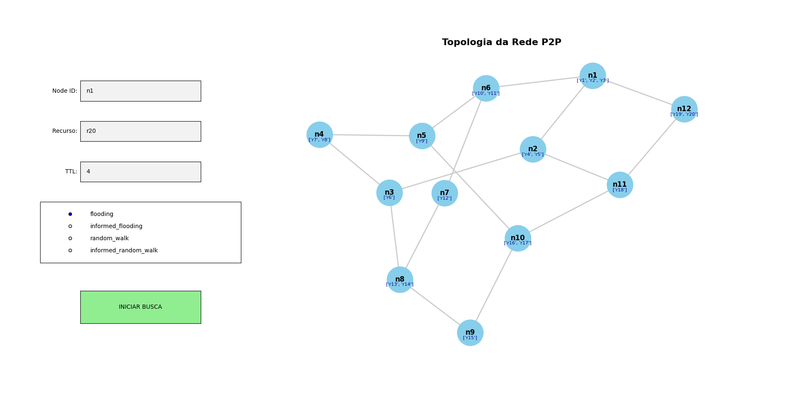

**Disciplina:** Computação Distribuída  
**Professor:** Nabor Mendonça  
**Equipe:**
* Fernanda Ortega - 2310305
* Guadalupe Prado - 2310300
* Letícia Cunha - 2315055

# Simulador de Algoritmos de Busca em Redes P2P

Este projeto é uma simulação em Python de uma rede Peer-to-Peer (P2P), desenvolvida como parte da disciplina de Computação Distribuída. O simulador permite construir topologias de rede a partir de arquivos JSON, validar rigorosamente a integridade do grafo e testar diferentes algoritmos de roteamento para localizar recursos, monitorando o custo de tráfego de mensagens.


## Funcionalidades

* **Ingestão e Validação de Topologia:** Carregamento de redes P2P customizadas via JSON, com motor de validação baseado em Teoria dos Grafos que garante:
  * Conectividade total (ausência de partições/ilhas).
  * Respeito aos limites de grau de cada nó (`min_neighbors` e `max_neighbors`).
  * Ausência de arestas circulares (*self-loops*).
  * Alocação obrigatória de recursos em todos os nós.

## Topologia da Rede
O simulador gera visualizações gráficas da rede utilizando a biblioteca NetworkX. Abaixo, um exemplo da topologia carregada (`rede_teste.json`):



* **Motores de Busca Implementados:**
  * `flooding`: Busca em largura concorrente.
  * `random_walk`: Roteamento de caminho único com implementação de *Backtracking* (recuo em becos sem saída).
  * `informed_flooding` & `informed_random_walk`: Algoritmos com inteligência de rede. Os nós atualizam seus dicionários locais (Cache) após o sucesso de uma busca e utilizam atalhos (*Cache HIT*) para reduzir o tráfego em requisições futuras.
* **Interface Gráfica Interativa (GUI):** Renderização visual da topologia usando `matplotlib`, incluindo um painel lateral nativo para inserção de parâmetros de busca (`node_id`, `resource_id`, `ttl`, `algo`) em tempo real para demonstrações ao vivo.
* **Rastreamento de Métricas:** Geração de logs textuais detalhando o tráfego pacote a pacote, reportando ao final o número exato de mensagens trocadas e nós únicos visitados.

---

## Tecnologias Utilizadas

* **Python 3.x**
* **NetworkX:** Para modelagem matemática, validação e cálculo espacial do grafo P2P.
* **Matplotlib:** Para renderização visual em camadas e construção da GUI interativa.

---

## Instalação e Execução

**1. Instalando dependencias**
```bash
pip install -r requirements.txt
```

**2.Execute o simulador**
```bash
python rede_p2p.py
```